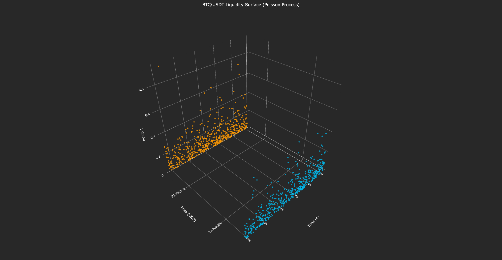
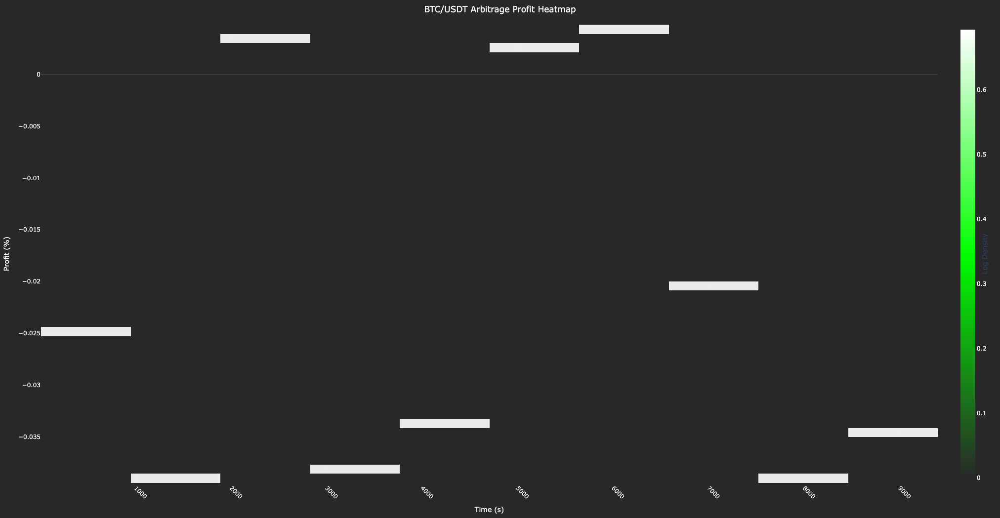

# crypto_arb_flow

- This project simulates order flow and detects triangular arbitrage opportunities across **BTC/USDT**, **ETH/USDT**, and **ETH/BTC** on Binance.
- It fetches order book data, simulates a Poisson-driven order flow, optimizes arbitrage execution, and visualizes liquidity and profit distributions.

---

## Files
- `crypto_arb_flow.py`: Main script for fetching order books, simulating order flow, detecting arbitrage, optimizing execution, and generating visualizations.
- No external dataset required; data is fetched live from Binance via `ccxt`.
- `liquidity.png`: 3D liquidity surface (price, volume, time) - Colors: `#FF9900` (BTC) to `#00B7EB` (ETH).
- `heatmap.png`: Arbitrage profit heatmap over time - Colors: `#00FF00` (profit) gradient.

---

## Libraries Used
- `numpy`
- `pandas`
- `plotly.graph_objects`
- `ccxt`
- `datetime`
- `scipy.optimize`

---

## Timeframe
- **Input**: Order book snapshot and simulated order flow over ~1000 seconds from **2024-10-12T00:00:00Z** to **2024-10-12T00:16:40Z** (configurable in code).
- **Output**: Liquidity surface and arbitrage profit heatmap for this period.

---

## Features
- Fetches real-time order book data from Binance for BTC/USDT.
- Simulates order arrivals using a Poisson process with stochastic intensity based on spread.
- Detects triangular arbitrage opportunities across BTC/USDT, ETH/USDT, and ETH/BTC pairs.
- Optimizes execution to minimize slippage and latency costs using SLSQP.
- Visualizes a 3D liquidity surface and a heatmap of arbitrage profits.

---

## Screenshots

